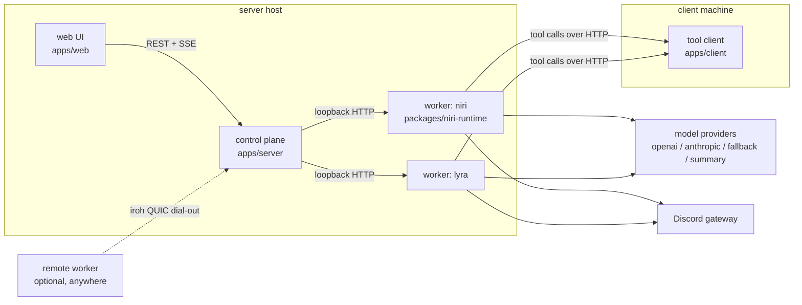
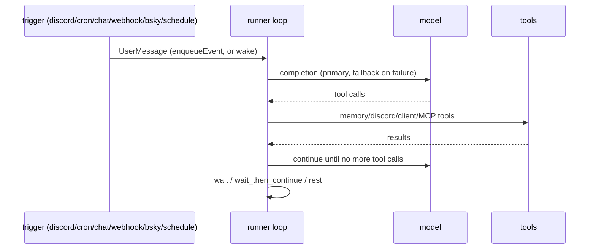

# Niri architecture

Niri is a harness for long-running personal agents. One control plane supervises any number of agent workers; each worker owns one agent's model loop, memory, and integrations. Tool clients run on arbitrary machines to give agents a workspace (shell, files, images).

## Processes

| Process | Package | Role |
| --- | --- | --- |
| Control plane | `apps/server` | Supervises local workers, hosts the control REST/SSE API and web UI, verifies webhooks, accepts remote-worker iroh dial-ins. |
| Agent worker | `packages/niri-runtime` | One per agent. Runs the model loop, owns the agent home (soul, memories, state, `niri.db`), connects Discord/MCP/bridges, dials the tool client. |
| Tool client | `apps/client` | Runs `shell`, `read_file`, `edit_file`, `image_tool`, and the internal `read_blob` chunk operation from a workspace on its own machine. |
| Web UI | `apps/web` | Dashboard over the control API: agent panels, live event stream, compactions, discord browser, chat input. |

Supporting libraries:

| Package | Role |
| --- | --- |
| `@mira/harness-protocol` | Wire envelopes, tool names/capabilities (`shell`, `read_file`, `edit_file`, `image_tool`, `read_blob`), validation. |
| `@mira/harness-core` | Executor interfaces + the LLM-facing client-tool catalog (`read_blob` is deliberately excluded). |
| `@mira/harness-server` | `HttpToolClient`: health, invocation delivery, reconnect. |
| `@mira/harness-client-node` | `NodeToolHost`: capability-gated tool execution — persistent PTY bash, path-validated file tools, bounded images, chunked verified blob reads. |
| `@niri/protocol` | `UserMessage`, `WorkerEvent`, control-command contracts. |
| `@niri/agent-config` | Shared agent-yaml parsing + env flattening (used by both the control plane and the standalone worker). |
| `@niri/iroh-transport` | iroh endpoint/secret helpers, BiStream↔socket pumps, loopback connection tunnels. |
| `@niri/chat-client` | Chat/SSE client for the CLI (`npm run chat`). |

## The worker loop

A worker alternates between asleep and awake:

- Triggers enter either by waking the loop (idle) or by enqueueing into the live session — never both. The cron heartbeat is a fixed `"Scheduled heartbeat."`; the `schedule` tool stores real reminders in `niri.db` and a 15s dispatcher fires them through the same path (overdue reminders fire on boot, and a reminder is never consumed during shutdown).
- Context is bounded by LCM compaction: older turns are summarized into a provenance tree stored in `niri.db`. The model can recover detail with `lcm_describe`, `context_grep`, and `context_expand` instead of drowning in verbatim history.
- `rest` ends the session after writing a durable snapshot; the next wake rebuilds context from bootstrap + snapshot.

## Memory and identity

An agent's home (`<home>`) holds:

| Path | Contents |
| --- | --- |
| `soul.md` | Identity; injected into every bootstrap. |
| `memories/` | Markdown long-term memory (core notes, journal, people files). |
| `state/` | Session snapshots, rest snapshots, `iroh.secret`. |
| `niri.db` | SQLite: conversations, worker events, memory FTS + `sqlite-vec` embeddings, discord history, LCM summaries, schedules. |

Memory tools are server-owned (`memory_search/read/write/ls/grep`, `memory_alias`, `soul_read`, `soul_write`) — the agent edits its own memory through them, never through client file tools. `memory_write`/`soul_write` support `append`, exact-substring `patch`, and `hashline` mode, which replaces or deletes lines addressed by `<line>#<hash>` anchors (hashes self-correct stale line numbers; empty content deletes). Anchors come from `memory_read`/`soul_read` with `hashline: true` or from `memory_grep`.

## Transports

**Worker ↔ control plane.** Local workers are spawned by the control plane and reached at `http://127.0.0.1:<port>`. Remote workers (`worker.mode: remote`) dial out over iroh (QUIC, NAT traversal via n0 relay): the worker authenticates with a JSON-line handshake (`agentId`, `instanceId`, `token`) and the server answers with an explicit ack that only fires once registration is complete. The server then exposes the connection as a loopback TCP tunnel — one BiStream per socket, pumped to the worker's loopback Fastify — so every control-plane feature (status, event enqueue, SSE stream) works unchanged over ordinary HTTP. Disconnects delete the agent's registration so nothing routes to a reused ephemeral port; registry removal is connection-identity-checked so same-instance reconnects can't evict their own replacement.

**Worker ↔ tool client.** The worker calls the client's HTTP endpoint (`client:` in the agent yaml, or `local` for same-host). `read_blob` transfers binaries as base64 chunks with per-chunk sha256 and size/mtime consistency checks; it is capability-gated like every tool but hidden from the model.

## Discord

The worker ingests via the gateway (plus periodic REST scans), batches channel context into digests, and gates wake/reply behavior with per-channel cooldowns. Outgoing, `discord_send` posts text with optional reply references and attachments from three sources: `path` (worker-local, home-relative), `client_path` (streamed from the tool client via `read_blob`), and `url` (downloaded with DNS-pinned, private-address-blocking fetch). Image attachments in incoming messages surface as CDN URLs for the agent to download and inspect with `image_tool`.

## Configuration

Agents are defined in `agents/*.yaml` on the control-plane host (see the README's yaml specification: model/fallback/embedding/summary providers, discord, MCP servers, webhooks, `worker.mode`, `server.iroh`, and raw `settings`). The control plane flattens yaml to environment for supervised workers; a remote worker does the same locally via `npm run start:worker:standalone -- --config <yaml>`. Runtime tuning (loop limits, compaction thresholds, image caps, batching) is read from env at call time, so most knobs apply without a restart.

## Security posture (honest list)

- The control REST API has no authentication; bind it to loopback or a trusted network.
- The tool client has no authentication; same rule. `0.0.0.0` binding means "trusted network only".
- Webhook ingress is HMAC-SHA256 verified per named webhook.
- iroh dial-ins require a shared token from `data/control/iroh.token`, generated 0600 on first boot.
- Agent yaml files hold model/discord credentials; keep them mode 0600.
- The shell tool is deliberately unmediated: the agent can run anything its client's user can run. Treat client hosts accordingly.
