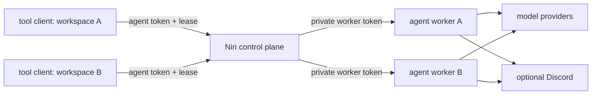

# Client/server harness



Each worker owns one agent's model loop and durable home. Each tool client owns one workspace. There is no server-local fallback for `shell`, `read_file`, `edit_file`, or `image_tool`.

## Workspace ownership

| Workspace | Owns |
| --- | --- |
| `@mira/harness-protocol` | Dependency-free wire envelopes and runtime validation. |
| `@mira/harness-core` | Host-neutral executor interfaces and the client-tool model catalog. |
| `@mira/harness-server` | Authentication, leases, invocation delivery, reconnect, and detach semantics. |
| `@mira/harness-client-node` | Persistent Bash, local/Docker file tools, bounded images, atomic replay journal, and long-poll transport. |
| `@niri/protocol` | Niri chat, trigger, and worker-event contracts. |
| `@niri/runtime` | One Niri agent worker: model providers, session, memory, narrow state writes, and optional Discord. |
| `@niri/server` | Control HTTP API, UI, agent registry, and local worker supervision. |
| `@niri/tool-client` | Niri's environment adapter around the generic Node tool client. |
| `@niri/chat-client` | Chat/status/SSE client used by the CLI and UI. |

The four `@mira/harness-*` packages are publishable packages with declaration-bearing `dist` exports, READMEs, explicit Node requirements, and exact internal version ranges. Their source contains no Niri, memory, Discord, provider, or UI contract. Other harness projects can implement `ClientToolHost` themselves or use the Node host.

## Install and run one local agent

Use Node.js 20.19+ or 22.12+, with npm 10 or newer. Install dependencies and copy the example environment:

```sh
npm install
cp .env.example .env
```

Configure a model provider, `NIRI_CONTROL_TOKEN`, and `NIRI_TOOL_CLIENT_TOKEN` in `.env`. Use different random values for the management and pairing tokens. `npm start` builds the reusable packages and web UI, starts the control plane on `127.0.0.1:3000`, and supervises one worker on `127.0.0.1:3001`.

```sh
npm start
```

Pair a client from a second terminal:

```sh
export NIRI_SERVER_URL='http://127.0.0.1:3000'
export NIRI_AGENT_ID='niri'
export NIRI_CLIENT_ID='niri-local'
export NIRI_TOOL_CLIENT_TOKEN='the-same-agent-client-token'
export NIRI_CLIENT_WORKSPACE="$HOME/Developer/project"
npm run start:client
```

`start:client` intentionally does not load the server `.env`; the client variables must be exported in that terminal or supplied by a dedicated client service definition. The model-controlled Bash process receives an operational allowlist rather than the daemon's parent environment and does not source user startup files. Add deliberate project variables with `NIRI_CLIENT_SHELL_ENV_JSON`.

Shell startup resolves symlinks and advertises the exact physical directory used as its initial `pwd`. Relative reads and edits follow that persistent shell directory. Capability typos fail startup instead of attaching an empty client.

## Run multiple agents

Set `NIRI_LOCAL_AGENTS_JSON` before `npm start`. Shell exports take precedence over `.env`.

```sh
export NIRI_LOCAL_AGENTS_JSON='[
  {
    "id": "mira",
    "port": 3101,
    "home": "./data/agents/mira",
    "toolClientToken": "mira-client-secret",
    "expectedClientId": "mira-macbook",
    "env": {
      "DISCORD_BOT_TOKEN": "mira-discord-token",
      "MODEL": "mira-model"
    }
  },
  {
    "id": "other-agent",
    "port": 3102,
    "home": "./data/agents/other-agent",
    "toolClientToken": "other-client-secret",
    "expectedClientId": "other-laptop",
    "env": {
      "DISCORD_GATEWAY_ENABLED": "false"
    }
  }
]'
npm start
```

The manager rejects unknown configuration keys; duplicate ids, ports, real homes, or credentials; cross-role token reuse; whitespace-equivalent Discord tokens; and every worker/control/Antigravity port collision. Worker environments do not receive the control token, agent registry, sibling configuration, sibling tokens, or a global state directory. Each worker receives its own `HOME`. An unexpected worker exit is restarted with backoff; manager shutdown waits for each worker's durable checkpoint before forcing it.

Identity, port, home, worker token, tool token, expected client id, and lifecycle variables belong at the top level of each agent object. They are rejected inside `env` so an override cannot silently defeat isolation.

## Remote access

Loopback is the default for both the control plane and managed workers. A management token is required on every bind. To expose the control plane, use TLS through a reverse proxy:

```sh
export NIRI_CONTROL_HOST='0.0.0.0'
export NIRI_CONTROL_TOKEN='long-management-secret'
npm start
```

Startup fails without `NIRI_CONTROL_TOKEN`. Management, chat, status, event, stream, shutdown, and registry routes require `Authorization: Bearer <NIRI_CONTROL_TOKEN>`. Tool-client routes are the only exception; they use the selected agent's `toolClientToken`. Health and static UI assets are public. The server does not emit permissive cross-origin headers, so another website cannot turn a browser into a localhost control client.

The chat CLI reads `NIRI_CONTROL_TOKEN`. To authorize the browser UI without putting the token in an HTTP request URL, open it once with a fragment:

```text
https://server.example/ui#token=long-management-secret
```

The UI moves the fragment into tab-scoped session storage and removes it from the address bar. Runtime `POST /agents` mutation is disabled by default; set `NIRI_ALLOW_DYNAMIC_AGENTS=true` only when authenticated dynamic registration is required. Static external workers should use `NIRI_AGENTS`, `NIRI_AGENTS_JSON`, or `NIRI_AGENT_URL` at startup.

Never send a worker, control, or tool-client token over plaintext beyond loopback.

## Client capabilities and Docker

The default client capabilities are:

```text
shell,read_file,edit_file,image_tool
```

Override them with `NIRI_CLIENT_CAPABILITIES`. Only attached capabilities appear in model requests, and dispatch checks the current catalog again before executing a returned tool call.

Set `NIRI_CONTAINER` and `NIRI_USER` together to use Docker. In Docker mode, `NIRI_CLIENT_WORKSPACE` and `IMAGE_ROOT` are paths inside the container. Python 3 is required inside that container for read/edit/image helpers.

The workspace is an initial directory and an identity boundary, not a filesystem sandbox. Shell can `cd` elsewhere and native file tools accept absolute paths with the client account's permissions. Use a dedicated local account or container when the agent should not have the rest of your client filesystem.

Client text results are transport-bounded by `NIRI_MAX_RESULT_BYTES` (default 512,000). Images are constrained by `IMAGE_TOOL_MAX_BYTES`, lexical and real-path root checks, decoded byte count, MIME allowlist, and file signature checks on both sides of the boundary.

## Reconnect and failure semantics

- Hello, poll, result, and detach requests are bound to agent id, client id, lease id, and bearer token.
- A second client cannot replace an active client or inherit its in-flight invocation.
- Completed-but-unacknowledged results are written atomically to a mode-0600 journal. After acknowledgement they are removed.
- The journal defaults to `~/.local/state/mira-harness/clients`, outside the attached project. Completed results are retried immediately after hello, before polling, so a lost acknowledgement or broker restart cannot strand secret output in the journal.
- A missing journal is a first run. A corrupt or unreadable journal fails closed instead of risking duplicate shell/edit execution.
- An invocation that reaches the client after its deadline is returned as cancelled without execution.
- A valid in-flight result can finish after the heartbeat lease expires because ownership is checked against the pending invocation credential.
- Graceful client shutdown calls detach, immediately removing capabilities and resolving pending work as unknown.

## Server-owned state

Each worker uses its own `NIRI_HOME`; session files live under `NIRI_HOME/state`. `soul_write` replaces only that agent's `soul.md`. `memory_write` can append to or replace only Markdown files under that agent's `memories/` directory. Client file tools never receive a server path.

On first run, the single implicit/default agent can copy legacy repository-root `session.json`, `rest-snapshot.json`, and `primary-failover.json` into its isolated state directory without deleting the source. Explicit multi-agent entries default migration to false so a new sibling cannot inherit Niri's history; opt in only on the one intended agent through its `env`. A migration marker prevents later resurrection of the old session chain.

Discord remains server-side. It has no arbitrary server-path attachment argument; client artifacts require an explicit future upload protocol instead of silently reading server files.

## Development and proof commands

```sh
npm run typecheck
npm test
npm run build
npm pack --dry-run --workspace @mira/harness-protocol
npm pack --dry-run --workspace @mira/harness-core
npm pack --dry-run --workspace @mira/harness-server
npm pack --dry-run --workspace @mira/harness-client-node
```

Each publishable package runs its build during `npm pack`/publish and cleans the ignored `dist` directory first, so a dist-free checkout still produces a complete tarball and removed modules cannot survive. Root typecheck first builds all declaration dependencies, checks root scripts, and then checks every workspace.

Discord.js 14.26.5 and `@discordjs/rest` 2.6.1 declare an exact `undici` 6.24.1 dependency. The root override is deliberately scoped to those parents and installs patched 6.27.0 until a stable Discord.js release updates the pin. npm 11 consequently labels that overridden workspace edge invalid in `npm ls undici`; `npm ci`, the lockfile, `npm audit`, and the test suite are the dependency gates. Remove the override when the stable upstream range is patched.

For a lightweight remote client, publish or pack the four `@mira/harness-*` packages and install `@mira/harness-client-node` on the client machine. Its `harness-tool-client` binary uses `HARNESS_ENDPOINT`, `HARNESS_AGENT_ID`, `HARNESS_CLIENT_ID`, `HARNESS_TOKEN`, and `HARNESS_CLIENT_WORKSPACE`; it does not require the Niri server/model/Discord/web dependency tree.
